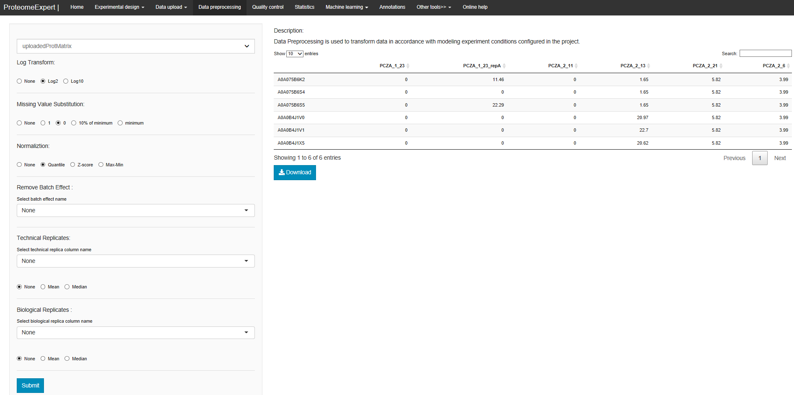

# ProteomeExpert-Data Preprocessing

## Overview
### Data Preprocessing
Data Preprocessing is used to transform data in accordance with modeling experiment conditions configured in the project. 

The protein matrix analyzed in Data Preprocessing should be uploaded in "Data Upload - select your protein file". Choose `select matrix: uploadedProtMatrix` for the following analysis. This module including methods for log transformation, missing value substitution,
normalization, batch effects adjustments (using Combat), and replicates treatment (using values of replicates to fill up missing values). 

- If you need to do a logarithmic transformation of the data, select `Log Transform` to accomplish. Here we display **Log2** and **Log10** method. Choose **None** to skip this step. 
- We provide four options for Missing Value Substitution: "**1**", "**0**", "**10% of minimum**" or "**minimum**".Choose **None** to skip this step.
- Three functions, i.e. "Quantile", "Z-score" and "Max-Min" could be used for data Normalization.

Besides,  we also offer replacement of **Mean** value or **Median** value in the treatment of `Technical Replicates` and `Biological Replicates` data. For unnecessary batches, select batch column name to `Remove Batch Effects`.

## Tutorial 

1. Download the  test data For this demo, we will be using a proteins matrix dataset, comprised of 3724 identified proteins from 24 samples. Download the _test_prot.txt_ file from "Online Help - Test data files used for data console - The test protein matrix contains 24 DIA runs" 
2. Upload the test file to "Data Upload - select your protein file". 
3. Go to Data Preprocessing and select "uploadedProtMatrix", set parameters *e.g.*:  
	- Log Transform: Log2
	- Missing Value Substitution: 0
	- Normalization: Quantile
	- Batch effects correction: None
	- Technical Replicates: None
	- Biological Replicates: None 
4. Click on `Submit`, waiting for the result that would be shown on the right side. 
5. Click on `Download` to get the _PreProcessed.txt_ file.

