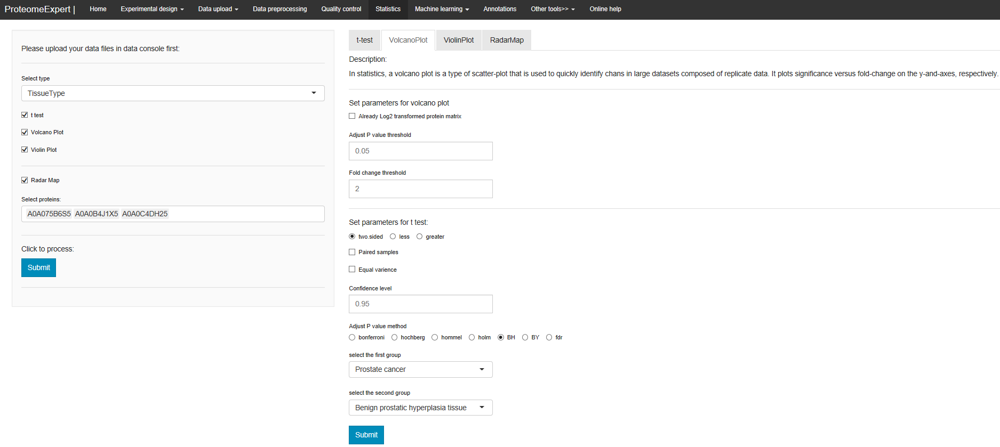
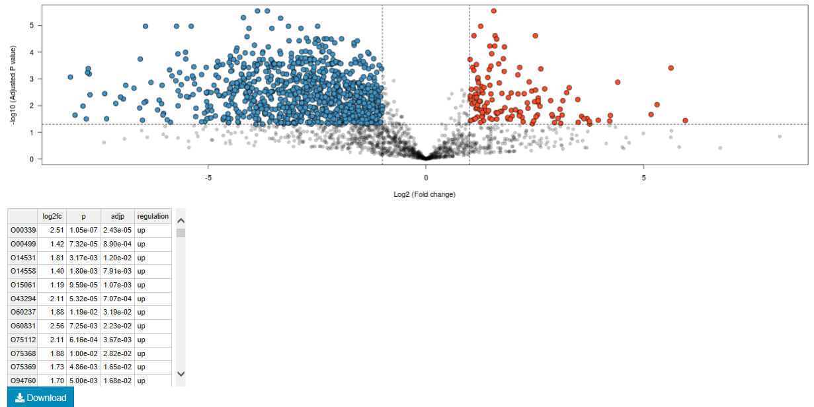
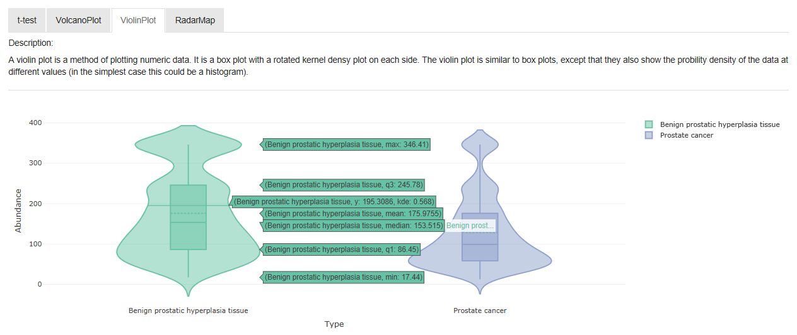

# ProteomeExpert-Statistics

## Overview
Here we provide some statistical methods for analyzing identified proteins:
  
  - *t*-test

*t*-test is any statistical hypothesis test in which the test statistic follows a Student's t-distribution under the null hypothesis.

- VolcanoPlot

Volcano plot is a type of scatterplot that is used to quickly identify changes in large datasets composed of replicate data. It plots significance versus fold-change on the y-and-axes, respectively.

- ViolinPlot

Violin plot is a method of plotting numeric data. It is a box plot with a rotated kernel density plot on each side. The violin plot is similar to box plots, except that it also shows the probability density of the data at different values (in the simplest case this could be a histogram).

- RadarMap

Radar chart is a graphical method of displaying multivariate data in the form of a two-dimensional chart of three or more quantitative variables represented on axes starting from the same point. The relative position and angle of the axes is typically uninformative.

## Parameters
For ***t*-test**, we provide the following parameters to be set:

1. Type:
	- Two sided *t*-test, H0: mu=0, Ha: mu!=0
	- One sided *t*-test:
	- Less (H0: mu=0, Ha: mu<0)
	- Greater (H0: mu=0, Ha: mu>0)
	- Click on `Paired samples` if you need to test whether the average of two samples is significantly different from the population they represent.
	- Click on `Equal variance` if two samples with equal variance suppose

	**Critical:** In the case of single-group design, a standard value or population mean must be given and a set of quantitative observation results should be provided. In the case of paired design, the difference of each pair of data must follow normal distribution. In the case of group design, individuals are independent with each other. Both groups of data are taken from the population of normal distribution and meet the homogeneity of variance. The reason why these preconditions are needed is that t statistics calculated under such preconditions must obey *t* distribution, and *t* test is the test method that takes *t* distribution as its theoretical basis.

2. Confidence level: usually 95%
3. Adjust *p* value method:
	- none 
	- bonferroni 
	- hochberg 
	- hommel 
	- holm 
	- BH 
	- BY 
	- fdr

For **VolcanoPlot**, we provide the following parameters to be set:

1. Click on `Already Log2 transformed protein matrix` if your proteins data had already been transformed at Data Preprocessing.
2. Adjust *p*-value threshold
3. Fold change threshold

## Tutorial 

1. The data analyzed in this part should have been uploaded in Data Console part.
2. Select your interesting column name, it is usually tissue/disease type. Here we choose **TissueType**.
3. Click on the four statistic methods: `t test`, `Volcano Plot`, `Violin Plot` and `Radar Map`
4. Click on `Submit`.
5. Click on `t-test` and set t-test parameters on the right side as following:
  - two.sided
- Equal variance
- Confidence level = 0.95
- Adjust *p*-value method: none
- Select the first group: Prostate cancer
- Select the second group: Benign prostate hyperplasia tissue
6. Click on `Submit`.
7. Click on `VocanoPlot` and set VocanoPlot parameters on the right side as following:
  - Already Log2 transformed protein matrix
- Adjust *p*-value threshold: 0.05
- Fold change threshold: 2

8. Click on `Submit`.

9. Click on `ViolinPlot` to see the ViolinPlot figure.

10. Click on `RadarMap` to see the ViolinPlot figure.

