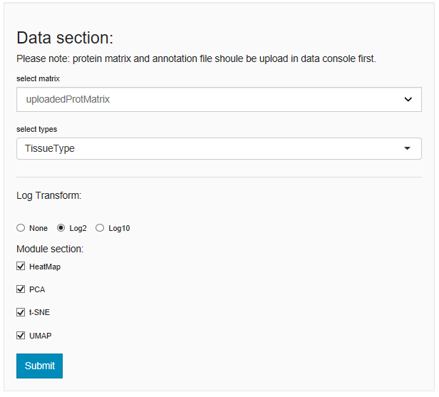
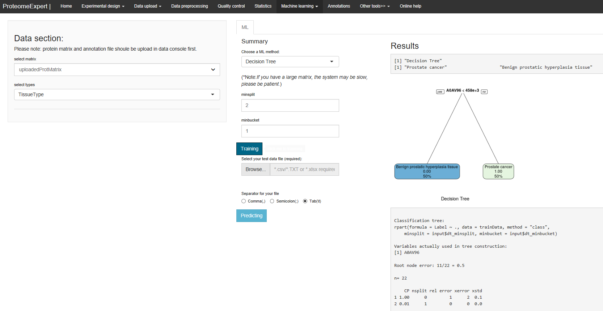

# ProteomeExpert-Machine learning

## Overview
Machine learning module includes feature selection, clustering and classification.
In the feature selection module, users not only apply filter methods to filter features of near zero variance and high correlation, but also apply additional feature selection methods: LASSO (Tibshirani, 1996), genetic algorithm, and random forest. As in clinical application classifying disease into subtypes is of great interest in the fields of diagnose and prognosis, users can perform various machine learning analyses: PCA, t-SNE, and UMAP for unsupervised analysis, and decision tree, random forest, and XGBoost for supervised learning.
 

## Feature selection
The feature selection is the process that choose a reduced number of explanatory variables to describe a response variable. The feature selection is even more important for the high-dimensional datasets, such as genomics and proteomics data. The main goal of proteomics biomarker discovery is to identify which are the most importance proteins associated with the disease. Here we used three well known feature selection methods: LASSO, genetic algorithm, and random forest. We show the process of these feature selection and describing how to use them for biomarker discover. 
LASSO is short of Least Absolute Shrinkage and Selection Operator. We used glmnet package in R (employ cv.glmnet function to choose the most appropriate tuning parameter λ, that controls the strength of the penalty and set α = 1 for LASSO regularization). Once the λ is set, glmnet function is used to do the feature selection according to this λ.
Genetic Algorithm (GA) is a stochastic optimization method inspired by the famous Charles Darwin’s idea of natural selection. Here we used the GA to select the right number of proteins to find positive biomarkers. We defined fitness function as the ROC divided number of features for two classification and accuracy divided number of features for multiple classification. Selection, crossover and mutation were done automatically by the ga function in GA package. Random forest is very popular in bioinformatics area and has achieved fantastic results. Functions sbf and rfe in randomForest package were applied here to afford feature selection using cross validation.

Upload the test files in "Data Upload" then set parameters *e.g.*: 

 

## Unsupervised
Following algorithms (implementation mainly based on R packages `pheatmap`, `stats` `tsne` and `umap`) are provided for selection:

- Heatmap
- PCA
- t-SNE 
- UMAP

Upload the test files in "Data Upload" then set parameters *e.g.*: 

 

 
The result of PCA (demo).
## Supervised
It includes the following algorithm:

- Decision Tree: implementation based on R packages `rpart` and `rpart.plot`
- Random forest: implementation based on R package `randomForest`
- XGBoost: implementation based on R package `xgboost`

Upload the test files in "Data Upload" then set parameters *e.g.*: 
 
The result of using decision tree (demo).